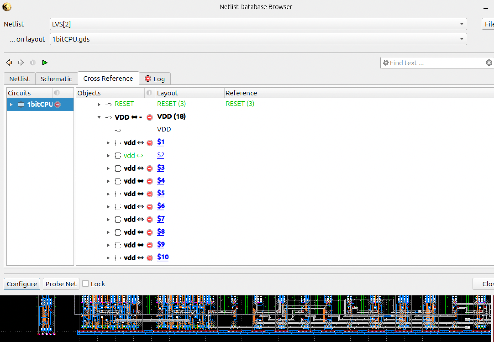

# CMOS Minimal CPU IC Design

A work-in-progress digital IC design project implementing a simple 1-bit CPU in CMOS.

## Current Status

This project is currently in progress.

The reference schematic and layout provided for this exercise do not currently pass LVS. I am using them as a starting point to understand the design and to debug the schematic-to-layout correspondence.

Initial LVS result of the provided reference design

  

Current work includes:

- Reviewing the reference schematic and layout
- Identifying the causes of LVS mismatches
- Correcting device connectivity and layout issues
- Re-running LVS verification
